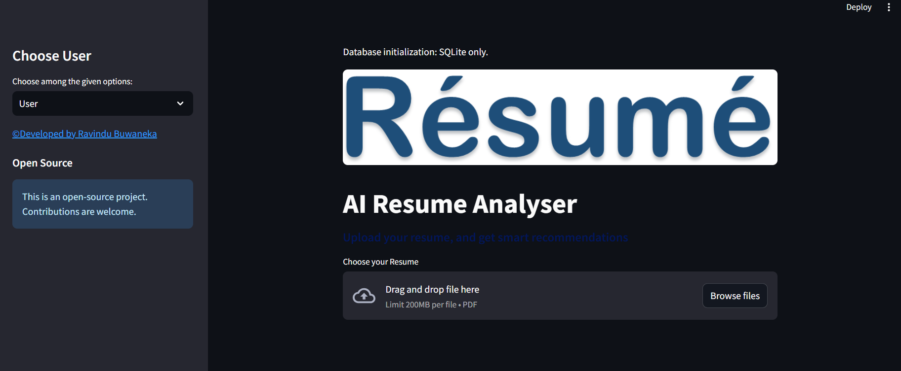

# AI Resume Analyzer (Streamlit)

Analyze resumes, extract key info, and recommend skills/courses — now Python 3.11 compatible, SQLite-backed, and open source.



### Features
- Upload a PDF resume and extract: name, email, phone, skills
- Skill-based recommendations with dynamic course lists fetched from public YouTube RSS feeds (no AI APIs)
- Local SQLite storage for user submissions
- Admin dashboard (view/export data, simple charts)
- Open source; contributions welcome

### Admin login
- Username: `briit`
- Password: `briit123`

## Quick start
Requirements: Python 3.11+

```bash
# Clone
git clone https://github.com/rbuwaENG/AI-Resume-Analyser-With-NLP.git
cd AI-Resume-Analyser-With-NLP

# Install
pip install --upgrade pip
pip install -r requirements.txt

# Optional: show a repo link in the sidebar
export REPO_URL="https://github.com/rbuwaENG/AI-Resume-Analyser-With-NLP"

# Run
streamlit run App.py
```

## Configuration
- `REPO_URL`: if set, a link to the repository appears in the sidebar under “Open Source”.
- Database: SQLite database file `cv.sqlite3` is created alongside `App.py` automatically.

## How recommendations work
- The app detects skills found in the resume text via keyword matching.
- For each skill domain (Data Science, Web, Android, iOS, UI/UX), it fetches recent videos from curated YouTube channels via RSS and filters them by relevant keywords.
- Results are cached for 7 days and fall back to the static lists in `Courses.py` if fetching fails.

## Project structure
- `App.py`: Streamlit app
- `Courses.py`: Static fallback course lists and video links
- `dynamic_courses.py`: Fetches and caches modern course links via YouTube RSS
- `Uploaded_Resumes/`: Uploaded files
- `Logo/`: Branding assets

## Contributing
Contributions are welcome! Please:
- Read [`CONTRIBUTING.md`](./CONTRIBUTING.md)
- Follow the [`CODE_OF_CONDUCT.md`](./CODE_OF_CONDUCT.md)
- Open an issue before large refactors

## Security
Please report vulnerabilities responsibly. See [`SECURITY.md`](./SECURITY.md).

## License
This project is licensed under the MIT License — see [`LICENSE`](./LICENSE).

## Credits
Developed by [Ravindu Buwaneka](https://www.linkedin.com/in/ravindu-buwaneka-42913a1a3). Originally inspired by community resume parsing projects.
